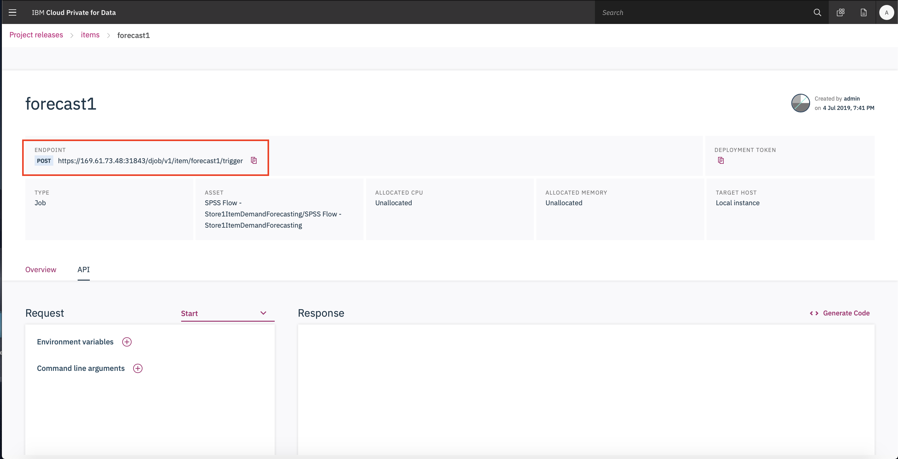

# Items Demand Forecast on Cloud Pak For Data
A data science project that forecasts the demand of various clothing items for different stores using a time series model on IBM SPSS Modeler. The entire data science pipeline (Data Understanding, Data Preparation, Modeling, Evaluation, Deployment) is built on Cloud Pak for Data, which is an end-to-end analytics platform.

IBM Cloud Pak for Data System is an all-in-one cloud-native Data and AI platform in a box, that enables you to collect, organize and analyze data with unprecedented simplicity and agility, within a pre-configured, governed environment.

### Steps to recreate the demo

Create a new project > Import from File > Select the zipped folder >  **Create Project**

- Click on **Sales Insights** to view the Dashboards created for the project.

- Click on **SPSS Flow** to view the SPSS Models created for forecasting the demand of different clothing items in multiple stores.

- Click on Forecast to view the end RShiny Web application. Within the RShiny code, add the scoring urls for the deployed models.

### Organize

To assign business terms and categories or to apply governance rules and policies, click on **Organize** section.

- Add the terms and categories in **Business Glossary** tab.

- Add the governance rules and policies.

- Commit the project to a local git and then push it.

- Create a project release and click on it to view the assets in the project.

- Create a deployment for SPSS models. Select the model > Create a job > deploy as a web service

- Add these endpoints to the RShiny app and run the application!

